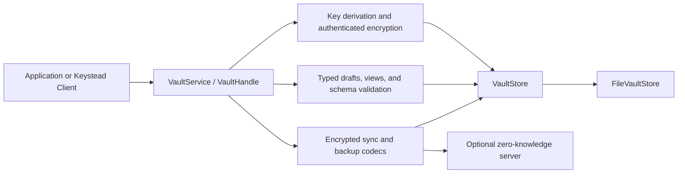

# Keystead Core

Keystead Core is a Java 21 library for building encrypted password and secret
vaults. It owns the parts of Keystead that must remain independent of a user
interface or synchronization server: key derivation, authenticated encryption,
typed secret schemas, local persistence, backup, synchronization records,
device provisioning, and key rotation.

This repository is intended for application developers, security reviewers,
and contributors. It is not the desktop application and it does not run a
server. The separately maintained Keystead Client uses this library; Keystead
Server stores and coordinates the opaque encrypted data produced by clients.

## Why Keystead Core exists

A password manager is more than a map of names to encrypted strings. It needs a
stable record model, explicit revision semantics, safe deletion propagation,
recoverable writes, key lifecycle rules, and APIs that avoid turning plaintext
into long-lived application state.

Keystead Core makes those rules part of the library instead of leaving every
client to invent them. Its design goals are:

- keep secret payloads encrypted at rest and outside narrowly scoped callbacks;
- make record and key state transitions explicit and testable;
- keep the synchronization server outside the decryption boundary;
- represent different credential types with canonical schemas;
- fail closed on unsupported algorithms, malformed rows, revision regressions,
  and incomplete device packages;
- preserve compatibility through versioned vault headers, records, and backup
  formats.

## Architecture



The boundaries have different responsibilities:

| Boundary | Responsibility |
| --- | --- |
| `VaultService` | Creates, opens, provisions, and rotates vaults. |
| `VaultHandle` | Performs typed secret operations while an unlocked vault key is alive. |
| Drafts and views | Expose plaintext through caller-controlled, short-lived callbacks. |
| `DefaultCryptoService` | Derives and wraps keys, encrypts payloads, and processes device key packages. |
| `VaultStore` | Defines durable vault-header, record, tombstone, and rotation operations. |
| Sync and backup codecs | Move encrypted rows without decrypting their secret payloads. |

`FileVaultStore` is the included filesystem implementation. The `VaultStore`
interface is deliberately separate so applications can supply another durable
store without replacing the cryptographic or record model.

## How a vault operation works

1. A master password derives a wrapping key using the KDF parameters stored in
   the vault header. The derived key unwraps a random vault key; it is not used
   directly as the record-encryption key.
2. `VaultHandle` keeps the unwrapped vault key only for the lifetime of the
   handle. Closing the handle destroys its owned key material.
3. A typed draft validates metadata and required fields against the canonical
   `SecretTypeSchema`.
4. The secret payload is encoded and encrypted with authenticated encryption.
   Vault ID, record metadata, and revision are encoded as authenticated data so
   rows cannot be silently moved or relabeled.
5. The store commits the encrypted record and its monotonic revision. Deletes
   become tombstones so another device can learn that a record was removed.
6. Reads decrypt inside a typed view callback. The caller decides how briefly
   to expose copied character or byte arrays.

The server, if used, receives encrypted profiles, encrypted envelopes, revision
data, tombstones, and wrapped vault-key packages. It does not receive the vault
key or plaintext secret fields.

## Capabilities

### Vault and record lifecycle

- Create and open password-protected vaults.
- Provision a vault from a device-wrapped vault-key package.
- Add, update, list, reveal, and delete typed secrets.
- Rotate the vault key and re-encrypt current records.
- Reject stale revisions and report import conflicts rather than silently
  replacing newer local state.

### Generators

- Configurable passwords and API tokens.
- Ed25519 and RSA SSH key material.
- RSA-first OpenPGP key pairs.
- MFA seeds and `otpauth` URIs.
- X.509 certificate/private-key bundles.

Generated private material is owned by `SecretBuffer`-based or
`AutoCloseable` values so callers can deterministically destroy it.

### Data movement

- Deterministic encrypted export ordered by revision and secret ID.
- Tombstone propagation and structured sync conflict reports.
- Versioned encrypted backup archives with manifest and entry integrity checks.
- Safe restore that rejects a conflicting existing vault header before writing.
- Device-specific wrapped vault-key packages for zero-knowledge provisioning.

## Secret type model

Keystead does not treat every item as an arbitrary collection of strings.
`SecretTypeCatalog` is the source of truth for field names, sensitivity,
required fields, reveal eligibility, import aliases, export names, optional
length limits, taxonomy defaults, and custom-field policy.

The current vocabulary is:

| Type | Typical protected fields |
| --- | --- |
| `LOGIN_PASSWORD` | Username, password, URL, and notes |
| `SECURE_NOTE` | Note body |
| `SSH_KEY` | Private key, public key, passphrase, and comment |
| `API_TOKEN` | Token, endpoint, and account context |
| `GPG_KEY` | Private key, public key, passphrase, and identity |
| `MFA_SECRET` | Seed and `otpauth` URI |
| `CERTIFICATE` | Certificate, private key, and passphrase |
| `GENERIC_SECRET` | Schema-permitted custom secret fields |

Strict types reject unknown or incomplete field shapes. This gives importers,
exporters, desktop forms, and protocol clients one effective vocabulary.

## Cryptography and key lifecycle

The default configuration uses PBKDF2-HMAC-SHA-256 with 120,000 iterations to
wrap a random vault key and AES-256-GCM for secret payloads. The algorithm
registry also recognizes PBKDF2-HMAC-SHA-512 and ChaCha20-Poly1305 for compatible
rows. Device wrapping uses an approved Tink ECIES P-256 package format.

These are format and implementation choices, not a claim that one fixed KDF
cost is ideal for every deployment. Applications should treat algorithm
registry changes and KDF upgrades as migrations, benchmark parameters for their
target hardware, and retain compatibility tests for existing vaults.

Key material is represented by owned objects such as `VaultKey`,
`DeviceKeyPair`, and `SecretBuffer`. They copy caller data at boundaries,
redact `toString()`, reject use after destruction, and wipe owned arrays when
closed. The JVM cannot guarantee that every transient copy is erased, so the
library minimizes ownership and lifetime rather than promising impossible
perfect memory erasure.

## Synchronization model

Synchronization operates on encrypted rows, not decrypted secrets.

- Revisions are positive and monotonic within a vault.
- Exports are stable by revision and secret ID.
- A delete produces a tombstone with no encrypted payload fields.
- Importing a newer tombstone removes the local active record.
- An older remote row cannot overwrite newer local state; conflicts are
  returned in `SyncImportReport`.
- Mixed-vault imports are rejected before any row is written.
- Server pagination advances through explicit revision cursors.

Automatic tombstone compaction is intentionally not implemented. The server
can record device pull acknowledgements and evaluate conservative eligibility,
but deleting tombstones automatically would require stronger retention and
device-acknowledgement guarantees.

## Backup and crash recovery

`BackupArchiveCodec` writes encrypted, versioned archives. Entry digests detect
corruption; they do not add secrecy beyond the encrypted payload. The reader
returns structured unsupported/corrupt-entry information where possible, and
restore reports skipped or conflicting rows.

`FileVaultStore` uses atomic replacement for durable files. Vault-key rotation
uses a journal because it changes the header, active records, and tombstones as
one logical operation. Startup recovery examines the journal and completes or
rolls back the interrupted transition. Crash-injection tests cover failures at
the journal and replacement boundaries.

## Security model and threat boundaries

Keystead Core is designed to protect a vault when encrypted files or the sync
database are copied by an attacker who does not possess the master password,
device private key, or unlocked vault key.

It does not protect against:

- malware or a debugger controlling the process while the vault is unlocked;
- a compromised client that captures plaintext before encryption;
- weak master passwords or poorly chosen deployment-specific KDF parameters;
- loss of every password, device key, and backup;
- malicious changes to the library binary or its dependencies;
- sensitive local listing metadata being observed by an attacker with access
  to the local vault directory. Secret payload fields are encrypted, but local
  record metadata exists to support listing and synchronization.

The optional server is zero-knowledge with respect to secret contents, but it
still observes operational information such as account identity, device IDs,
vault IDs, revisions, membership, timestamps, and ciphertext sizes. Zero
knowledge does not mean zero metadata.

## Public API example

```java
Path directory = Path.of("vault-data");
VaultId vaultId = new VaultId(UUID.randomUUID());
Console console = Objects.requireNonNull(System.console(), "A secure console is required");
char[] masterPassword = console.readPassword("Vault password: ");
char[] loginPassword = console.readPassword("Login password: ");

VaultService vaults = new DefaultVaultService(new FileVaultStore(directory));

try (VaultHandle vault =
        vaults.createVault(new CreateVaultRequest(vaultId), masterPassword);
     SecretBuffer username = SecretBuffer.fromChars("alice@example.com".toCharArray());
     SecretBuffer password = SecretBuffer.fromChars(loginPassword)) {

    SecretId id = vault.saveLogin(draft -> draft
            .title("Example account")
            .username(username)
            .password(password)
            .url("https://example.com"));

    vault.withLogin(id, view ->
            view.withPassword(chars -> usePasswordBriefly(chars)));
} finally {
    Arrays.fill(masterPassword, '\0');
    Arrays.fill(loginPassword, '\0');
}
```

The application owns the input password array and must wipe it. Secret views
provide copied data only inside callbacks; callers should avoid converting it
to immutable `String` values.

## Repository structure

```text
keystead-core/src/main/java/top/focess/keystead/
|-- crypto/      key ownership, algorithms, wrapping, and AEAD
|-- generator/   password, token, SSH, GPG, MFA, and certificate generation
|-- memory/      wipeable secret buffers
|-- model/       vault IDs, schemas, encrypted rows, and metadata
|-- service/     public vault, backup, and sync workflows
`-- store/       persistence abstraction and filesystem implementation
```

Production Java APIs use explicit JSpecify annotations. Tests cover value
invariants, crypto behavior, persistence recovery, synchronization, backups,
device provisioning, schema consistency, and nullness semantics.

## Build and verification

Requires JDK 21.

```bash
./gradlew :keystead-core:test --no-daemon --rerun-tasks
./gradlew :keystead-core:spotlessCheck
```

On Windows, use `gradlew.bat`. The current complete suite contains 220 tests.

## Comparison with established products

Keystead Core is a library and protocol foundation, while the products below
are mature end-user applications or services. The useful comparison is design
orientation, not a claim of feature parity.

| Project | Design orientation | Where Keystead differs today |
| --- | --- | --- |
| [Bitwarden](https://contributing.bitwarden.com/architecture/security/principles/servers-are-zero-knowledge/) | Zero-knowledge synchronization with a mature hosted and self-hosted ecosystem. | Keystead makes typed record schemas, deterministic revision/tombstone rules, and crash-journaled local rotation unusually explicit, but lacks Bitwarden's browser/mobile ecosystem and production history. |
| [1Password](https://1password.com/files/1Password-White-Paper.pdf) | Managed multi-platform service whose design combines an account password with a locally created Secret Key. | Keystead is self-hostable and library-first; it does not yet offer 1Password's polished recovery, device coverage, administration, or integrations. |
| [KeePassXC](https://keepassxc.org/docs/) | Mature offline KDBX desktop vault; cloud synchronization is delegated to file-sync providers and browser integration is well established. | Keystead defines a first-party encrypted row-sync protocol and server, but its desktop/browser experience is much less mature. |
| [Proton Pass](https://proton.me/pass/security) | Consumer-focused end-to-end encrypted service with encrypted metadata, cross-platform apps, aliases, passkeys, and sharing. | Keystead exposes its core data model and self-hosted server boundary directly, but lacks Proton Pass's platform reach, audits, alias service, and consumer polish. |

## Honest project assessment

### What is strong

- The core, server, and client agree on explicit encrypted-row and lifecycle
  contracts instead of relying on loosely shaped JSON.
- Typed secret schemas are centrally owned and tested across repository
  boundaries.
- Sync conflict, tombstone, device eligibility, and rotation behavior are
  modeled as state transitions with regression coverage.
- Secret-bearing value types are deliberately redacted and short-lived.
- The server can remain operationally useful without receiving decryption
  capability.

### What is not yet mature

- No browser extension or browser autofill.
- No Android or iOS client.
- No passkey/WebAuthn login or native biometric unlock.
- No independent security audit, public bug-bounty history, or long-running
  production deployment evidence.
- No polished account-recovery system; loss of key material can mean permanent
  loss of access.
- Desktop secure storage currently has an abstraction and encrypted file
  fallback, not completed OS-native adapters.
- Sharing and rotation primitives exist, but the full collaborative user
  experience is still narrower than established products.

Keystead should currently be evaluated as a serious, test-heavy engineering
foundation and an experimental password-manager system, not as a drop-in
replacement for a widely audited production password manager.

## Contributing

Contributions should preserve the zero-knowledge boundary, explicit JSpecify
nullness, finite schema vocabulary, backward-readable encrypted formats, and
fail-closed persistence behavior. Add tests at the lowest meaningful boundary,
then run the complete core suite and formatting checks before submitting a
change.

Changes that alter algorithms, authenticated data, vault headers, revisions,
backup formats, or device packages require migration and compatibility tests;
they are protocol changes, not local refactors.
