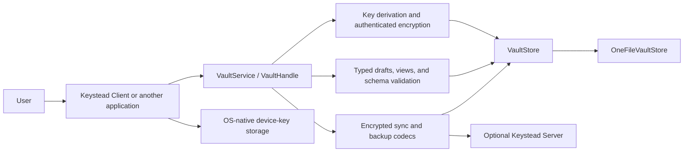

# Keystead Core

[](https://www.apache.org/licenses/LICENSE-2.0)

Keystead Core is the Java 25 security and data-model foundation of Keystead, a
local-first, zero-knowledge secret-vault system. Core owns the behavior that
must remain independent of any UI or synchronization service: key derivation,
authenticated encryption, typed secret schemas, native secret memory, local
persistence, encrypted backup and sync formats, device provisioning, recovery,
and key rotation.

This repository is written for Java integrators, security reviewers, and
contributors. People looking for the desktop password manager should start
with Keystead Client; self-hosters should start with Keystead Server.

Keystead is under active development. The API, ABI, and on-disk protocol are
not stable across releases; consume a pinned released version.

## The Keystead ecosystem

Keystead is delivered as three independently versioned repositories:

| Project | For | Responsibility |
| --- | --- | --- |
| **[Keystead Core](https://github.com/MidCoard/keystead)** | Java developers and contributors | Cryptography, secret models, vault persistence, encrypted interchange formats, recovery and rotation primitives, and native memory/process protection |
| **[Keystead Client](https://github.com/MidCoard/keystead-client)** | Desktop users | Local vault UI, generators, reveal and clipboard lifecycle, OS-native device-key storage, sync, sharing, rotation, backup, and recovery workflows |
| **[Keystead Server](https://github.com/MidCoard/keystead-server)** | Self-hosters and operators | Accounts, verified devices, opaque encrypted-row synchronization, wrapped-key distribution, collaboration, rotation/recovery coordination, and audit events |

The product-level security boundary is composed from all three projects. Core
encrypts and owns the protocol; Client is where plaintext is used and where
Windows DPAPI, macOS Keychain, or Linux Secret Service protects device identity
material; Server coordinates ciphertext and public lifecycle state without
receiving a raw vault key or plaintext secret.

## What Core provides

- **Vault lifecycle.** Create and open passphrase-protected vaults; provision a
  vault from a device-wrapped key package; add, update, list, reveal, and delete
  typed secrets; rotate the vault key; reject stale revisions and report import
  conflicts instead of silently overwriting newer local state.
- **Generators.** Passwords and API tokens; Ed25519 and RSA SSH key material;
  RSA-first OpenPGP key pairs; MFA seeds and `otpauth` URIs; RFC 6238 TOTP
  current codes; X.509 certificate/private-key bundles. Generated private
  material is owned by `SecretBuffer`-based or `AutoCloseable` values so callers
  can deterministically destroy it.
- **Data movement.** Deterministic encrypted export ordered by revision and
  secret ID; tombstone propagation and structured sync conflict reports;
  versioned encrypted backup archives with manifest and entry integrity checks;
  safe restore that rejects a conflicting existing vault header before writing;
  device-specific wrapped vault-key packages for zero-knowledge provisioning.
- **Recovery and key lifecycle.** Offline recovery-kit material derived and
  encrypted on the client; recovery-bound vault-key packages; canonical
  verified-device recovery requests signable by an existing trusted device;
  prepared vault-key rotations that stage the next key without disturbing the
  live vault until every recipient package is ready, with restart-safe
  resumption and an atomic local commit.
- **Single-secret sharing.** Share one secret as a self-contained encrypted
  string unlockable with a temporary passphrase; the recipient needs no vault
  and no account.

## Architecture


```mermaid
flowchart LR
    User["User"] --> Client["Keystead Client or another application"]
    Client --> API["VaultService / VaultHandle"]
    API --> Schema["Typed drafts, views, and schema validation"]
    API --> Crypto["Key derivation and authenticated encryption"]
    API --> Sync["Encrypted sync and backup codecs"]
    Crypto --> Store["VaultStore"]
    Schema --> Store
    Sync --> Store
    Store --> File["OneFileVaultStore"]
    Client --> OS["OS-native device-key storage"]
    Sync --> Server["Optional Keystead Server"]
```

| Boundary | Responsibility |
| --- | --- |
| `VaultService` | Creates, opens, provisions, and rotates vaults. |
| `VaultHandle` | Performs typed secret operations while an unlocked vault key is alive. |
| Drafts and views | Expose plaintext through caller-controlled, short-lived callbacks. |
| `DefaultCryptoService` | Derives and wraps keys, encrypts payloads, and processes device key packages. |
| `VaultStore` | Defines durable vault-header, record, tombstone, and rotation operations. |
| Sync and backup codecs | Move encrypted rows without decrypting their secret payloads. |

`OneFileVaultStore` is the included filesystem implementation. The `VaultStore`
interface is deliberately separate so applications can supply another durable
store without replacing the cryptographic or record model.

## The vault

A vault is a single opaque `.kvault` file. It is
identified locally by its **file path** and unlocked by a credential; there is
no vault id. The same vault key is wrapped under several independent unlock
credentials, any one of which opens the vault:

- a **passphrase** (PASSPHRASE slot), wrapped with an Argon2id-derived key;
- one or more **device keys** (DEVICE slots), wrapped with a Tink hybrid
  (ECIES P-256) keypair;
- one or more **recovery keys** (RECOVERY slot), wrapped the same way.

The **vault fingerprint** is a non-secret, passphrase-derived 64-bit routing
identity. It is stored in the plaintext header, used by the server to route
sync rows, and bound into every record's authenticated data. It is stable
across vault-key rotation and changes only when the passphrase or salt changes.

The vault file is **never uploaded**. Records reach other devices through
encrypted sync rows (server-mediated) or an out-of-band file copy / backup
restore. The server is zero-knowledge: it stores accounts, verified-device
state, the fingerprint, encrypted sync rows, wrapped key packages, and share
blobs, and it observes row counts and sizes - but it never receives a
passphrase, salt, wrapping key, data-encryption key, or plaintext.

## Encrypt and decrypt

A vault uses **envelope encryption**: the contents are encrypted with a random
data key, and that data key is itself encrypted under one or more unlock
credentials. Splitting the two means changing the passphrase, or adding a device
or recovery key, never re-encrypts the records - only the data key is re-wrapped.

- The **passphrase** is the password the user memorizes and types to unlock. It
  is never stored and never leaves the device that opens the vault; it is the
  input to a password key-derivation function (KDF) - Argon2id - not a key used
  directly on the data.
- The **DEK** (data-encryption key) is 32 random bytes generated once per vault.
  It is the only key that ever touches the vault contents.
- The **wrapping key** is derived from the passphrase with Argon2id. It exists
  only to encrypt (wrap) the DEK and to derive the fingerprint; it is not stored.

**Encrypt:** the DEK encrypts the vault contents; the wrapping key, derived from
the passphrase, encrypts the DEK. The file stores the wrapped DEK and the
encrypted contents - never the passphrase, the wrapping key, or the DEK itself.

**Decrypt:** the user types the passphrase; Argon2id turns it into the wrapping
key, which unwraps the DEK, which decrypts the contents. A wrong passphrase
yields the wrong wrapping key, so the DEK unwrap fails its authenticity check and
the vault does not open.

The rest of this section is the exact process. All integers are big-endian; the
AEAD is AES-256-GCM with a 12-byte nonce; keys are 32 bytes.

### The mechanics, concept by concept

The step lists below use a few terms, explained here once.

**`‖` means byte concatenation.** `‖` (ASCII `||` in RFCs) joins two byte
strings end to end with no separator, so a decoder must already know where each
field ends: fields are fixed-width (the 12-byte nonce) or length-prefixed
(`u16 len + bytes`). For example, `wrappedVaultKey = nonce ‖ ciphertext` is the
12-byte nonce followed by the ciphertext, split at byte 12.

**Key wrapping.** Encrypting a key with another key is *key wrapping*: the
wrapping key encrypts the DEK, and the DEK encrypts the container. This
indirection makes a passphrase change cheap (rewrap the DEK, not every record)
and lets each unlock method (passphrase, device, recovery) wrap the same DEK.

**The plaintext-header values.** Four values sit in the plaintext header:

- **salt** (16 random bytes): the Argon2id salt; plaintext because it is needed
  to re-derive the wrapping key.
- **fingerprint** (8 bytes): the routing identity (see *Keys* below); stored so
  the server can route sync rows and passphrase-less opens can read it.
- **keyId** (`vault-<uuid>`): a name for the DEK marking its generation, used by
  rotation and backup-restore to reject an old-generation archive (its rows are
  encrypted under the old DEK).
- **nonce** (12 random bytes): the AES-GCM nonce for one encryption, prepended
  to the ciphertext so it can be read back on decrypt.

**AAD (additional authenticated data).** AES-256-GCM is an AEAD: it encrypts the
plaintext and also emits an integrity tag that can cover extra unencrypted data
(AAD). Decryption must supply the same AAD or the tag fails, so AAD binds a
ciphertext to a context. The DEK wrap uses the keyId as AAD; the container
encryption uses the entire serialized header as AAD, so tampering with any
header byte fails the container tag.

**Envelope vs. container.** The *container* is the vault payload (body version,
revision counter, records, tombstones) - the only thing encrypted with the DEK.
The *envelope* is the cleartext record holding the result: `{algorithm, keyId,
nonce, ciphertext, encryptedAt}`.

### Keys

- **DEK**: id `vault-<uuid>`, 32 random bytes. Never derived from the passphrase.
  Encrypts the container body and every record payload.
- **Wrapping key** (the key-encryption key, KEK): `Argon2id(passphrase, salt, {iterations=2, memory=19456 KiB, parallelism=1})`,
  producing 32 bytes. It wraps the DEK in the PASSPHRASE slot only. The Argon2id
  parameters and salt travel in the slot.
- **Fingerprint**: a non-secret 64-bit routing identity derived from the
  wrapping key, **not from the DEK**:
  `HMAC-SHA-256(wrappingKey, "keystead-vault-fingerprint-v3" ‖ salt)` truncated to
  the first 8 bytes, where `wrappingKey = Argon2id(passphrase, salt)`. Stored in
  the plaintext header and disclosed to the server.

**Why the fingerprint is safe to expose.** It is derived from the wrapping key,
not the DEK, so it has no relationship to the vault key, and as a truncated
HMAC-SHA-256 output it reveals nothing about the wrapping key or the passphrase.
It adds no offline-brute-force surface beyond the wrapped DEK already in the
file (recovering the DEK still costs a full Argon2id computation plus an AEAD
tag check). This rests on HMAC-SHA-256 being a pseudorandom function; the
derivation is versioned (`keystead-vault-fingerprint-v3`) and can be rotated if
that primitive ever weakens.

**Why 64 bits.** On the server the fingerprint only needs to tell two vaults
apart, and one account holds at most one vault, so any width would do. 64 bits
is the smallest width that still leaves a comfortable ~2^32 collision margin for
the AAD/sync binding; going wider would buy nothing.

### Create a vault

1. Generate the DEK: 32 random bytes from `SecureRandom` - this is the AES-256
   key that encrypts the vault contents. Assign it a non-secret label
   `keyId = "vault-" + UUID` (a name for the key, not the key itself).
2. Generate a 16-byte salt and build the Argon2id parameters
   `{iterations=2, memory=19456 KiB, parallelism=1}`.
3. `wrappingKey = Argon2id(passphrase, salt, parameters)`.
4. `fingerprint = HMAC-SHA-256(wrappingKey, "keystead-vault-fingerprint-v3" ‖ salt)[:8]`.
5. Wrap the DEK:
   `nonce = random(12)`; `ciphertext = AES-256-GCM-Encrypt(wrappingKey, nonce, DEK, AAD = keyId)`;
   `wrappedVaultKey = nonce ‖ ciphertext`.
6. Build the header: format version `3`, the fingerprint, `vaultKeyId`, one
   PASSPHRASE slot `{slotKeyId="passphrase", kdf, wrappedVaultKey}`, and
   timestamps.
7. Build an empty container body (`bodyVersion=1`, `vaultRevision=0`) - the
   vault payload that holds secret records and tombstones; it is encrypted next.
8. Encrypt the container:
   `containerNonce = random(12)`;
   `containerCiphertext = AES-256-GCM-Encrypt(DEK, containerNonce, body, AAD = serializedHeader)`.
   The envelope records `{version=1, algorithm="AES-256-GCM", keyId=vaultKeyId, nonce=containerNonce, ciphertext=containerCiphertext, encryptedAt}`.
9. Write `serializedHeader ‖ serializedEnvelope` with an atomic replace.

### Open a vault (passphrase)

1. Read the file. Parse the header, remembering `headerBytes` (the bytes
   `[0, headerEnd)`). Parse the envelope.
2. Select the first PASSPHRASE slot.
3. `wrappingKey = Argon2id(passphrase, slot.salt, slot.parameters)`.
4. Split `wrappedVaultKey` into `nonce ‖ ciphertext`.
   `DEK = AES-256-GCM-Decrypt(wrappingKey, nonce, ciphertext, AAD = header.vaultKeyId())`.
   A wrong passphrase fails the AEAD tag.
5. `body = AES-256-GCM-Decrypt(DEK, envelope.nonce, envelope.ciphertext, AAD = headerBytes)`.
   A tampered header or ciphertext fails the AEAD tag; because the header is the
   AAD, this is a single whole-vault integrity check.
6. Read the fingerprint from the header and decode the body into records and
   tombstones.

The fingerprint is read from the header; it is not recomputed and compared on
open. Its integrity comes from the container AEAD tag (the header is the AAD).

### Open a vault (device or recovery key)

1. Parse the header and envelope as above.
2. Find the DEVICE or RECOVERY slot whose `slotKeyId` matches this device or
   recovery enrollment.
3. `DEK = HybridDecrypt(recipientPrivateKey, slot.wrappedVaultKey, context)`
   using Tink ECIES P-256. No passphrase and no server round-trip.
4. `body = AES-256-GCM-Decrypt(DEK, envelope.nonce, envelope.ciphertext, AAD = headerBytes)`.
5. Read the fingerprint from the header and decode the body.

### Save a record

1. Validate the draft against the canonical `SecretTypeSchema`.
2. Serialize all of the record's field values into one payload, and encrypt it
   into a single record envelope:
   `payloadNonce = random(12)`;
   `payloadCiphertext = AES-256-GCM-Encrypt(DEK, payloadNonce, encodedFields, AAD = SecretRecordAad.encode(fingerprint, metadata, revision))`;
   store one record envelope
   `{version=1, algorithm, keyId=vaultKeyId, nonce=payloadNonce, ciphertext=payloadCiphertext, encryptedAt}`.
   `SecretRecordAad` binds the label `keystead-secret-record-v3`, the
   fingerprint, secret id, type, title, classification, tags, profile
   attributes, timestamps, and revision, so a record envelope is self-
   authenticating and cannot be moved across vaults.
3. Update the in-memory record set and bump the monotonic vault revision.
4. Re-serialize the container body, re-encrypt it with the container AEAD
   (`AAD = serializedHeader`), and atomically replace the file. Whole-vault
   atomicity makes a multi-record mutation a single rewrite under the file lock.

### Read a record

The vault is already open (the DEK lives in memory for the handle's lifetime).
Decrypt the record's payload envelope:
`payload = AES-256-GCM-Decrypt(DEK, envelope.nonce, envelope.ciphertext, AAD = SecretRecordAad.encode(...))`,
then decode the requested fields from it, handed to the caller inside a
short-lived callback. The copied array is wiped when the callback returns.
Closing the handle destroys its owned key material.

### Rotate the vault key (DEK)

Rotation swaps the DEK for a new one and re-encrypts the vault under it. It cuts
off a key that may be exposed (a lost or compromised device, a leaked wrapped
key) and, together with removing a device's slot, stops that device reading
future data. The passphrase and fingerprint do not change - only the DEK and its
`keyId` do.

1. Generate a new DEK with a new `keyId`.
2. Re-encrypt the container body under the new DEK (`AAD = header`).
3. Re-wrap the new DEK into **every** existing slot: the PASSPHRASE slot uses the
   same wrapping key (the passphrase is unchanged), and each DEVICE/RECOVERY
   slot is hybrid-encrypted to its recipient.
4. Update `vaultKeyId` in the header and re-AEAD. The fingerprint is unchanged
   because the wrapping key is unchanged. Wrapped packages on the server are
   re-published for each device.

### Change the passphrase

1. Generate a new salt and Argon2id parameters; derive a new wrapping key.
2. Re-wrap the DEK into the PASSPHRASE slot under the new wrapping key.
3. Recompute the fingerprint (it changes) and update the stored fingerprint.
4. Re-AEAD and re-bind server sync to the new fingerprint.

## Vault file format

File extension: `.kvault` (e.g. `personal.kvault`). Magic `"KSTEAD"`, format
version `3`. All integers are big-endian; lengths are unsigned.

```
HEADER  (plaintext; also the container AAD)
  magic[6]              "KSTEAD"
  version[1]            3
  fingerprint[8]        HMAC-SHA-256(wrappingKey, label‖salt), low 64 bits
  vaultKeyId            u16 len + UTF-8       (the DEK id; binds the container to its key)
  slotCount             u16                   (>= 1)
  slots[slotCount]:
    slotType[1]         1=PASSPHRASE, 2=DEVICE, 3=RECOVERY
    slotKeyId           u16 len + UTF-8       ("passphrase" | deviceId | enrollmentId)
    kdfAlgorithm        u16 len + UTF-8       (PASSPHRASE only; else empty)
    kdfSalt             u16 len + bytes       (PASSPHRASE only; else empty)
    kdfParamCount       u16                   (PASSPHRASE only; else 0)
    kdfParams[paramCount]:
      name              u16 len + UTF-8       ("iterations" | "memory" | "parallelism" | ...)
      value             s32
    wrappedVaultKey     s32 len + bytes       (PASSPHRASE: nonce ‖ AEAD(wrappingKey, DEK);
                                               DEVICE/RECOVERY: hybrid ciphertext)
  createdAt             s64 epochSeconds + s32 nanos
  updatedAt             s64 epochSeconds + s32 nanos
ENVELOPE  (ciphertext; AAD = the serialized header bytes above)
  envelopeVersion[1]    1
  algorithm             u16 len + UTF-8       ("AES-256-GCM")
  keyId                 u16 len + UTF-8       (== vaultKeyId)
  nonce                 u8 len + bytes        (12)
  ciphertext            s32 len + bytes       (encrypted container body)
  encryptedAt           s64 epochSeconds + s32 nanos
```

The header is plaintext because it must be readable before any key is derived:
the unlock code reads the slots to pick a credential and reads the KDF
parameters to derive the wrapping key. Secrecy rests on the DEK and the
container ciphertext; integrity rests on the container AEAD tag, since the
header is the AAD. The fingerprint is stored in the header so a passphrase-less
DEVICE or RECOVERY open can recover the routing identity without deriving it.

### Container body

The container body is the plaintext that the envelope's `ciphertext` field
decrypts to under the DEK; in the file it exists only as that ciphertext. It is
encrypted once, as a whole, on every save. Encryption happens at two separate
levels, shown separately below.

**Container level (at rest).** The whole `BODY` is encrypted as one blob with
the DEK (`AAD = serializedHeader`) to form the envelope's `ciphertext`. This
protects every part of it: the body version, the vault revision, each record's
metadata (secret id, classification, tags, profile, timestamps, revision), and
the tombstones.

```
BODY
  bodyVersion[1]        1
  vaultRevision         s64
  recordCount           s32
  records[recordCount]:
    secretId            u16 len + UTF-8
    secretType          u16 len + UTF-8
    title               u16 len + UTF-8
    classification      (category, provider, software, account, labels)
    tags                string set
    profile             attribute map
    createdAt           s64 + s32
    updatedAt           s64 + s32
    revision            s64
    payload             (the record payload envelope - see below)
  tombstoneCount        s32
  tombstones[tombstoneCount]:
    secretId            u16 len + UTF-8
    secretType          u16 len + UTF-8
    revision            s64
    deletedAt           s64 + s32
```

Reading the body top to bottom: `bodyVersion` is the container format version.
`vaultRevision` is a monotonic counter bumped on every mutation - it is the sync
cursor and the basis for conflict resolution. `records` are the active secrets;
`tombstones` are deletion markers. A tombstone (`secretId`, `secretType`,
`revision`, `deletedAt`, and no payload) records that a secret was deleted, so
the deletion propagates to other devices and an older copy of the record cannot
resurrect it.

**Record level (per record).** All of a record's field values are serialized and
encrypted together into one payload envelope - `AES-256-GCM` under the DEK with
`AAD = SecretRecordAad.encode(fingerprint, metadata, revision)`, which binds the
payload to that record's metadata. The metadata itself is stored in plaintext
inside the body (covered by the container level above), not encrypted again.

```
RECORD PAYLOAD ENVELOPE (one per record)
  envelopeVersion[1]  1
  algorithm           u16 len + UTF-8   ("AES-256-GCM")
  keyId               u16 len + UTF-8   (== vaultKeyId)
  nonce               u8 len + bytes    (12)
  ciphertext          s32 len + bytes
  encryptedAt         s64 + s32
```

Because each record's payload is its own encrypted envelope, a single record can
be lifted out still-encrypted and synced on its own, without decrypting it -
this is what travels in sync.

**At rest vs. in memory.** On disk the file is always the whole encrypted
container. On open, the container is decrypted once - the outer layer is
stripped in memory - leaving each record's metadata readable but its payload
still encrypted. A record's payload is decrypted only when that record is
viewed, then wiped; unviewed records stay encrypted. Every save re-serializes
and re-encrypts the whole container before writing.

### Atomic write

A save serializes the whole container, writes to a sibling `.tmp` file,
`fsync`s, atomically moves it into place (`Files.move(ATOMIC_MOVE)`), and
`fsync`s the directory. A single writer is enforced with a `FileLock`.

## Key slots

Every slot wraps the **same DEK**. A vault opens by satisfying **any one** slot.

- **PASSPHRASE slot.** `wrappingKey = Argon2id(passphrase, salt, {iterations, memory, parallelism})`;
  `wrappedVaultKey = nonce ‖ AES-256-GCM-Encrypt(wrappingKey, DEK, AAD = vaultKeyId)`.
  On open, derive the wrapping key, split the wrapped bytes, and AEAD-decrypt
  the DEK. `slotKeyId = "passphrase"`.
- **DEVICE slot.** A device generates a Tink ECIES P-256 keypair; the private
  key stays on the device, protected by OS-native storage (Windows DPAPI, macOS
  Keychain, Linux Secret Service). The public key wraps the DEK:
  `wrappedVaultKey = HybridEncrypt(devicePublicKey, DEK, context)`. On open the
  device uses its private key to `HybridDecrypt(devicePrivateKey, wrappedVaultKey, context) -> DEK`
  - no passphrase, no server round-trip. `slotKeyId = deviceId`.
- **RECOVERY slot.** A recovery keypair (also ECIES P-256) is generated together
  with an offline recovery kit. The recovery public key wraps the DEK:
  `wrappedVaultKey = HybridEncrypt(recoveryPublicKey, DEK, context)`. The recovery
  private key is encrypted by the kit and stored on the server; the printable kit
  stays with the user. During recovery the kit decrypts the recovery private key,
  which then `HybridDecrypt`s the wrapped DEK. `slotKeyId = enrollmentId`.

Slot lifecycle:

- **createVault** writes one PASSPHRASE slot and no DEVICE/RECOVERY slots.
- **add device** wraps the DEK to the new device's public key, appends a DEVICE
  slot, and re-AEADs (the header changed). The new device also receives a
  server-stored `DeviceVaultKeyPackage` (wrapped DEK + fingerprint) for
  first-time bootstrap; afterwards it opens via its local DEVICE slot with no
  server round-trip.
- **add recovery** wraps the DEK to a recovery public key and appends a RECOVERY
  slot.
- **rotateVaultKey** generates a new DEK, re-encrypts the container, re-wraps
  into every slot, and re-AEADs. Fingerprint unchanged.
- **changePassphrase** uses a new salt and wrapping key to re-wrap the
  PASSPHRASE slot, recomputes the fingerprint, updates the header, re-AEADs, and
  re-binds server sync to the new fingerprint.
- **remove slot** (revoke device or recovery) drops the slot and re-AEADs.
  Revocation protects future access; it cannot erase records the recipient
  already decrypted.

## Device keys and recovery keys

Device and recovery keys are both Tink ECIES P-256 keypairs: the public key wraps
the DEK into a slot, the private key unwraps it. They differ in where the
private key lives and what it is for.

### Device keys

A device key opens the vault on one device without the passphrase.

- **Create.** The device generates an ECIES P-256 keypair. The private key never
  leaves the device; it is protected by OS-native storage (Windows DPAPI, macOS
  Keychain, Linux Secret Service). Only the public key is shared.
- **Provision a new device.** A brand-new device has no slot yet, so an existing
  unlocked device wraps the DEK for the new device's public key
  (`wrapVaultKeyPackageForDevice`) and the package travels via the server. The
  new device unwraps the DEK with its private key (`provisionVault`) and writes
  its own vault file with a DEVICE slot. This first step is the only one that
  needs the server or an existing device.
- **Open (everyday).** The device finds its DEVICE slot and unwraps the DEK with
  its private key (`openVaultWithDeviceKey`) - no passphrase, no server
  round-trip.
- **Revoke.** Removing the DEVICE slot blocks future opens; rotating the DEK
  afterwards keeps the revoked device from reading anything written after the
  rotation (it cannot erase what it already read).

### Recovery keys

A recovery key regains access when the passphrase and every device are lost.

- **Create.** Enrollment generates an ECIES P-256 keypair plus an offline
  **recovery kit** (a random secret). The recovery public key wraps the DEK into
  a RECOVERY slot. The recovery private key is encrypted under the kit and
  stored on the server; the printable kit stays with the user, offline.
- **Recover (offline kit).** Presenting the kit authenticates a short-lived
  session (the server checks a hash of the kit's credential). The client
  retrieves the kit-encrypted recovery private key and decrypts it locally with
  the kit, unwraps each current vault DEK, and re-wraps it for the replacement
  device. The server then changes the account password and enrolls the
  replacement device.
- **Recover (verified device).** Alternatively, a replacement device publishes a
  signed request and an existing verified device approves it, wrapping the DEK
  for the replacement's public key - no kit needed.

In all of these the server holds only public keys, the kit-encrypted recovery
private key, and wrapped DEK packages - never the passphrase, a device or
recovery private key in the clear, or the DEK itself.

## Cryptographic primitives

| Purpose | Primitive | Notes |
| --- | --- | --- |
| Vault DEK | AES-256-GCM (Tink) | 32-byte key, 12-byte nonce. Encrypts the container body and every record payload. |
| Passphrase KDF | Argon2id (Bouncy Castle) | Memory-hard; `{iterations=2, memory=19456 KiB, parallelism=1}` by default. Parameters and salt travel in the PASSPHRASE slot. |
| DEK wrap (PASSPHRASE) | AES-256-GCM under `Argon2id(passphrase, salt)` | AAD = the DEK key id. Wrapped bytes = `nonce ‖ ciphertext`. |
| DEK wrap (DEVICE / RECOVERY) | Tink hybrid ECIES P-256 (HKDF-HMAC-SHA-256 + AES-128-GCM) | `HybridEncrypt(recipientPublicKey, DEK, context)`; unwrapped with the recipient private key. |
| Device proof key | Ed25519 | Signs server login challenges; distinct from the wrapping keypair. |
| Fingerprint | `HMAC-SHA-256(wrappingKey, "keystead-vault-fingerprint-v3" ‖ salt)` truncated to 64 bits | Non-secret routing identity; stable across DEK rotation. |
| Container integrity | AES-256-GCM tag over the body, AAD = serialized header | Header tampering and a wrong passphrase both fail the tag. |
| Per-record integrity | AES-256-GCM per record, AAD = `SecretRecordAad` (label `keystead-secret-record-v3`) | Each sync row is self-authenticating and fingerprint-bound. |
| Share temp-passphrase KDF | PBKDF2-HMAC-SHA-256 (Tink), 120 000 iterations | For single-secret shares; bounded by a min-strength floor. |

The KDF layer is pluggable: a `PasswordKeyDerivation` provider is registered by
algorithm name in `DefaultCryptoService`, and `KdfParameters` carries
`(algorithm, salt, Map<String,Integer> parameters)` so any approved KDF's
parameters round-trip in a slot. The default providers are Argon2id,
PBKDF2-HMAC-SHA-256, and PBKDF2-HMAC-SHA-512. Unknown algorithms and unsupported
parameters fail closed; Core does not fall back to another KDF.

### Key and secret material ownership

Key material is represented by owned objects such as `VaultKey`,
`DeviceKeyPair`, and `SecretBuffer`. They copy caller data at boundaries, redact
`toString()`, reject use after destruction, and wipe owned arrays when closed.
`SecretBuffer` is a provider-backed facade over `SecretMemoryProvider`. The
convenience default is `SecretMemoryProvider.systemDefault()`, which returns the
fail-closed `NativeLockedSecretMemoryProvider`: secret bytes are copied into a
page-locked native buffer, and a missing native prerequisite raises
`NativeMemoryUnavailableException` rather than silently falling back to heap
memory. Applications that must tolerate the absence of native access can
explicitly downgrade with `SecretMemoryProvider.heap()`, and every convenience
type retains an overload that accepts an explicit provider. See
[Native memory and process hardening](#native-memory-and-process-hardening).

Wiping and page locking reduce the lifetime and exposure of Keystead-owned
copies, but they are not a guarantee of perfect erasure or full live-memory
resistance. Locking prevents locked pages from being paged to disk and dump
exclusion removes them from core dumps on supported platforms; neither defeats a
debugger, an injected agent, a privileged process reader, copying garbage
collection, JIT or native temporaries, or a copy owned by a cryptographic or
memory provider.

Recovery-kit material follows the same ownership model. `RecoveryKitCodec`
encodes a kit with `encodeSecret(RecoveryKit)` and decodes with
`decode(SecretBuffer)`, so the complete encoded kit lives only in mutable,
closeable storage; there is no `String`-returning codec, because an immutable
secret `String` remains visible in JVM heap dumps and cannot be wiped
deterministically. `DeviceKeyPair` exposes its private key only through
`copyPrivateKey(Consumer<byte[]>)`, which hands bytes to a callback without
retaining a copy; there is no accessor that returns the private key as an array.

### Resource ceilings

Core enforces resource ceilings at untrusted file, envelope, package, sync, and
KDF boundaries:

| Input | Maximum |
| --- | ---: |
| Stored properties file | 1,048,576 bytes |
| Encrypted-envelope ciphertext | 1,048,576 bytes |
| Encrypted-envelope authenticated data (AAD) | 65,536 bytes |
| Container body record or tombstone collection | 1,000,000 entries |
| Encoded sync profile | 2,097,152 characters |
| Encoded sync envelope | 2,097,152 characters |
| Wrapped device or recovery vault-key package | 1,048,576 bytes |
| Password-KDF salt | 64 bytes |
| PBKDF2 iterations | 10,000,000 |
| Canonical KDF parameters | 16 entries; printable ASCII names of at most 64 characters; positive integer values no greater than `Integer.MAX_VALUE` |

## Secret type model

Keystead does not treat every item as an arbitrary collection of strings.
`SecretTypeCatalog` is the source of truth for field names, sensitivity,
required fields, reveal eligibility, import aliases, export names, optional
length limits, taxonomy defaults, and custom-field policy.

The current vocabulary is:

| Type | Typical protected fields |
| --- | --- |
| `LOGIN_PASSWORD` | Username, password, URL, and notes |
| `SECURE_NOTE` | Note body |
| `SSH_KEY` | Private key, public key, passphrase, and comment |
| `API_TOKEN` | Token, endpoint, and account context |
| `GPG_KEY` | Private key, public key, passphrase, and identity |
| `MFA_SECRET` | Seed and `otpauth` URI |
| `CERTIFICATE` | Certificate, private key, and passphrase |
| `GENERIC_SECRET` | Schema-permitted custom secret fields |

Strict types reject unknown or incomplete field shapes. This gives importers,
exporters, desktop forms, and protocol clients one effective vocabulary.

## Single-secret sharing

Share **one** secret as a self-contained encrypted string
`keystead-share:v1:<base64url>`, unlockable with a temporary passphrase. The
recipient needs no vault and no account. The temp passphrase is the **only**
key: `PBKDF2-HMAC-SHA-256` (120 000 iterations, mint-time floor) over a
per-share salt produces the 32-byte AES-256-GCM key. A min-strength floor
(>= 12 characters and >= 3 of 4 character classes) bounds offline brute-force of
a leaked string. No fingerprint, vault id, or key id is embedded; a share is
unlinked from the vault. The server, when used for a short link, routes by an
opaque share id it issues and hosts only transport and lifecycle
(expiry / view-once / revoke); the decryption key never touches the server, and
there is no link-fragment key mode.

### Wire format

`keystead-share:v1:` followed by base64url (no padding) of the byte stream below
(all integers big-endian):

```
magic[4]              "KSTS"
version[1]            1
HEADER  (plaintext; = AEAD AAD, bytes [0, headerEnd))
  kdfAlgorithm        u16 len + UTF-8   ("PBKDF2WithHmacSHA256")
  kdfSalt             u8  len + bytes
  kdfIterations       s32
  nonce               u8  len + bytes   (12)
ENVELOPE
  envelopeVersion[1]  1
  algorithm           u16 len + UTF-8   ("AES-256-GCM")
  ciphertext          s32 len + bytes   (the encrypted BODY below)
BODY  (the decrypted form of `ciphertext` above - it lives inside that field, not after it)
  bodyVersion[1]      1
  shareId             u16 len + UTF-8   (UUID string)
  secretType          u16 len + UTF-8   (SecretType name)
  title               u16 len + UTF-8
  fieldCount          s32
  fields[fieldCount]
    name              u16 len + UTF-8
    value             u16 len + UTF-8
  hasNote[1]          0/1
  sharerNote          u16 len + UTF-8   (only if hasNote)
  createdAt           s64 seconds + s32 nanos
  hasExpiresAt[1]     0/1
  expiresAt           s64 seconds + s32 nanos   (only if hasExpiresAt)
```

The plaintext header (magic through nonce) is the AEAD AAD, so any tampering
with versioning or KDF parameters is detected at decryption. Fields are sorted
by name at mint time for deterministic encoding. `createdAt` (inside the
authenticated body) conveys mint time, so the envelope carries no separate
`encryptedAt`.

### Mint and redeem

- **Mint** (holder of the secret): choose a temp passphrase meeting the floor,
  build a `ShareDraft` (secret type, title, fields, optional note, optional
  expiry), and produce the string via `ShareService.create`.
- **Redeem** (recipient): paste the string, enter the temp passphrase, and view
  the recovered `ShareContents` in a short-lived, wiped view via
  `ShareService.open`. A wrong passphrase fails the AEAD tag; an expired share
  is rejected after decryption, so the failure mode does not leak whether
  decryption succeeded.
- **Automation**: automation principals (API tokens / CI) mint shares from a
  vault they hold a vault-key package for, via the server API. Humans mint via
  the client.

```java
ShareService shares = new ShareService(crypto);

Map<String, String> fields = new LinkedHashMap<>();
fields.put("username", "alice");
fields.put("password", "s3cret-pw");

String shareString = shares.create(
        new ShareDraft(SecretType.LOGIN_PASSWORD, "Alice login", fields),
        tempPassphrase);              // tempPassphrase is wiped by create

ShareContents contents = shares.open(shareString, tempPassphrase);  // wiped by open
contents.fields().get("password");
```

The passphrase arrays are wiped by `create` / `open` on return, including on
failure. `ShareContents` holds recovered plaintext `String` fields (Java strings
cannot be wiped deterministically), so callers should consume them promptly and
avoid retaining the object.

## Synchronization model

Synchronization operates on encrypted rows, not decrypted secrets. Each record
is encrypted independently (its own envelope inside the container), so a single
record can be exported still-encrypted and synced on its own; the
whole-container encryption protects the file at rest and is not what travels.

- Each record exports as an `EncryptedSyncRecord` whose profile AAD is
  `"keystead-sync-profile-v2|{fingerprint}|{secretId}|{revision}"`.
- The server stores per-record encrypted rows keyed by `(account, fingerprint)`.
- Import verifies each row's AAD against the local fingerprint; a row minted for
  a different fingerprint is rejected (cross-vault injection is defeated).
- Revisions are positive and monotonic within a vault. Exports are stable by
  revision and secret ID. An older remote row cannot overwrite newer local
  state; conflicts are returned in `SyncImportReport`. Mixed-vault imports are
  rejected before any row is written. Server pagination advances through
  explicit revision cursors.
- A delete produces a tombstone with no encrypted payload fields; importing a
  newer tombstone removes the local active record.

The server sees only: account, fingerprint (opaque), encrypted rows, and row
counts/sizes. Never passphrase, salt, wrapping key, DEK, or plaintext. The
local one-file format is decoupled from the sync wire format: sync transfers
records, not the container file.

Automatic tombstone compaction is intentionally not implemented. The server can
record device pull acknowledgements and evaluate conservative eligibility, but
deleting tombstones automatically would require stronger retention and
device-acknowledgement guarantees.

## Native memory and process hardening

Keystead Core uses the Java 25 Foreign Function and Memory API to keep secret
material in locked native memory and to expose strict, process-wide hardening.
The public contracts live in `top.focess.keystead.memory` and
`top.focess.keystead.security`; FFM segments, addresses, and raw causes never
leave the internal packages.

`SecretMemoryProvider.systemDefault()` (alias `nativeLocked()`) returns the
fail-closed `NativeLockedSecretMemoryProvider`. `protect(byte[])` copies the
value into a page-locked native buffer owned by a shared `Arena`; a missing
prerequisite raises `NativeMemoryUnavailableException` instead of falling back
to heap memory. `SecretMemoryProvider.heap()` is the explicit downgrade for
deployments without native access, and every convenience type retains an
overload that accepts an explicit provider.

Native protection is bounded and lifecycle-closed. `NativeSecretMemory` runs an
`ALLOCATED -> LOCKED -> DUMP_EXCLUDED -> COPY_STARTED -> LIVE` state machine:
allocation, locking, and (on Linux) dump exclusion are verified before the
buffer is live, a one-pass volatile wipe and unlock run on close, and an
owner-free `Cleaner` releases the page if an owner is abandoned. Quota
exhaustion does not reopen access to a closed buffer. `NativeMemoryProtection.inspect()`
performs a one-page allocate/lock/dump-exclude/wipe/unlock/release probe
without retaining the page and returns a redacted `NativeMemoryProtectionReport`
with one entry per `NativeProtectionControl` in enum order; capability failure
is report data and never throws.

The backends share a reviewed ABI layer and capture `errno` or the Windows last
error into redacted results:

| Platform | Memory backend | Process hardening |
| --- | --- | --- |
| Windows x86-64 | Kernel32 `VirtualAlloc`/`VirtualLock`/`VirtualUnlock`/`VirtualFree` | OS debugger isolation is `APPLICATION_REQUIRED` |
| Linux x86-64/AArch64 | libc `mmap`/`mlock`/`munmap` with `madvise(MADV_DONTDUMP)` | `prctl(PR_SET_DUMPABLE)` and `setrlimit(RLIMIT_CORE)` |
| macOS x86-64/AArch64 | libc `mmap`/`mlock`/`munlock` | `setrlimit(RLIMIT_CORE)` |

`ProcessHardening.inspect()` returns a redacted `ProcessHardeningReport`
snapshot of the applicable controls without mutating, so it never reports
`HardeningStatus.ENFORCED`. `ProcessHardening.applyStrict()` is serialized,
monotonic, idempotent, and non-transactional: it completes every immutable
prerequisite preflight before mutating, then sets and verifies dumpability and
the core limit on Linux and the core limit on macOS. Deployment responsibilities
Core cannot safely enforce are reported as `HardeningStatus.APPLICATION_REQUIRED`.
The hard `RLIMIT_CORE` limit is lowered irreversibly for an unprivileged
process, so `applyStrict()` is intended to run in an expendable child JVM rather
than a long-lived host process; `inspect()` is the non-mutating entry point.

Consuming applications must grant native access to the Core module:
`--enable-native-access=top.focess.keystead.core` on the module path, or
`--enable-native-access=ALL-UNNAMED` on the classpath. Under
`--illegal-native-access=deny` or without the grant, the native provider fails
closed. On Linux, `mlock` is bounded by `RLIMIT_MEMLOCK` and `CAP_IPC_LOCK`;
deployments that want locked secret memory should raise the memlock limit or
grant the capability. Locked memory and dump exclusion are bounded in-memory
guarantees: they keep the secret off disk via swap and crash dumps, but they do
not stop a live-memory attacker - a debugger or privileged process reads the
process's address space directly, which locking cannot prevent.

## Backup and crash recovery

`BackupArchiveCodec` writes encrypted, versioned archives. Entry digests detect
corruption; they do not add secrecy beyond the encrypted payload. The reader
returns structured unsupported/corrupt-entry information where possible, and
restore reports skipped or conflicting rows.

`OneFileVaultStore` uses atomic replacement for durable files. Vault-key
rotation uses a journal because it changes the header, active records, and
tombstones as one logical operation. Startup recovery examines the journal and
completes or rolls back the interrupted transition. Crash-injection tests cover
failures at the journal and replacement boundaries.

## Security model and threat boundaries

Keystead Core protects a vault when encrypted files or the sync database are
copied by an attacker who does not possess the passphrase, device private key,
or unlocked vault key.

It does not protect against:

- malware or a debugger controlling the process while the vault is unlocked;
- a compromised client that captures plaintext before encryption;
- a weak passphrase or poorly chosen deployment-specific KDF parameters;
- loss of every passphrase, device key, and backup;
- malicious changes to the library binary or its dependencies;
- sensitive local listing metadata being observed by an attacker with access to
  the local vault directory (secret payload fields are encrypted, but record
  metadata exists to support listing and synchronization).

The optional server is zero-knowledge with respect to secret contents, but it
still observes operational information such as account identity, device IDs,
vault fingerprints, revisions, membership, timestamps, and ciphertext sizes.
Zero knowledge does not mean zero metadata.

### What Core enforces

- A passphrase derives a wrapping key; record encryption uses a separate random
  DEK.
- Algorithms and their parameters are explicit, versioned, and checked through
  fail-closed registries.
- Record identity, metadata, revision, and vault context are authenticated with
  the ciphertext.
- Secret-bearing Core values have explicit ownership, redacted diagnostics,
  use-after-close checks, and deterministic wipe-on-close behavior.
- Native locked memory is the system default. Failure to allocate, lock, or
  establish the required native protection raises an exception instead of
  silently downgrading to ordinary heap storage.
- Sync revisions, tombstones, backup formats, device packages, recovery
  packages, and rotation state have bounded, validated representations.
- `OneFileVaultStore` uses atomic replacements and a recovery journal so an
  interrupted multi-file key rotation can be completed or rolled back.

### OS-native protection across Keystead

| Layer | Implemented protection |
| --- | --- |
| Core | Java 25 FFM backends for locked native memory; Linux dump exclusion; Linux/macOS core-dump controls; inspection and redacted reports |
| Client | Windows DPAPI, macOS Keychain, and Linux Secret Service for the device wrapping and proof private keys |

Memory protection belongs next to the secret-memory abstraction in Core.
Credential-store integration belongs in Client because it depends on application
identity, UI-visible fallback choices, and the signed-in desktop user.

`ProcessHardening.applyStrict()` is intentionally explicit. It changes the
entire host JVM, can irreversibly lower the hard core-file limit for an
unprivileged process, and therefore must be called by an application or an
expendable child JVM at the correct lifecycle point. Core provides the
implementation and reports application-required controls; it does not mutate a
host process merely because the library was loaded.

### Integrator and deployment responsibilities

Applications using Core must:

- grant Java native access to the named module or unnamed classpath module;
- decide whether failure-closed native memory is mandatory or whether an
  explicit `SecretMemoryProvider.heap()` downgrade is acceptable;
- run `ProcessHardening.inspect()` during deployment validation and invoke
  strict hardening only in a process whose lifecycle permits it;
- configure Linux memlock limits or capabilities when locked pages are required;
- keep plaintext inside short-lived mutable buffers and callbacks, avoid
  immutable `String` copies where practical, and wipe caller-owned arrays;
- choose how device identity material is protected. Keystead Client provides the
  product's DPAPI, Keychain, Secret Service, passphrase-file, and memory-only
  implementations.

### What these controls do not promise

Locked pages, dump exclusion, wiping, and process dump controls reduce
accidental persistence and post-crash disclosure. They cannot prevent a
debugger, injected agent, same-process code, privileged process reader, or
malware that already controls the live application from observing plaintext
while the vault is unlocked.

OS-user-protected credential storage means protection by the signed-in user's
platform facility. It is not biometric-gated release through Windows Hello,
Touch ID, or another platform authenticator. Another process running with the
same user authority may be inside that facility's trust boundary.

Recovery and collaboration preserve the same boundary. Offline recovery kits
and verified-device approval keep vault-key operations on clients, but the
server cannot reconstruct a vault after every kit, eligible device, usable
header, and backup has been lost. Removing a collaborator and rotating the key
protects future key generations; it cannot erase information the former member
already decrypted or copied.

Keystead currently provides a JVM desktop application and self-hosted server.
Core can support additional clients, but browser integration, mobile
applications, passkey/WebAuthn login, and biometric-gated vault unlock are not
implemented in the current product surface.

## Public API example

```java
Path vaultFile = Path.of("vault.kvault");
Console console = Objects.requireNonNull(System.console(), "A secure console is required");
char[] masterPassword = console.readPassword("Vault password: ");
char[] loginPassword = console.readPassword("Login password: ");

VaultService vaults = new DefaultVaultService();

try (VaultHandle vault =
        vaults.createVault(new CreateVaultRequest(vaultFile), masterPassword);
     SecretBuffer username = SecretBuffer.fromChars("alice@example.com".toCharArray());
     SecretBuffer password = SecretBuffer.fromChars(loginPassword)) {

    SecretId id = vault.saveLogin(draft -> draft
            .title("Example account")
            .username(username)
            .password(password)
            .url("https://example.com"));

    vault.withLogin(id, view ->
            view.withPassword(chars -> usePasswordBriefly(chars)));
} finally {
    Wipe.wipe(masterPassword);
    Wipe.wipe(loginPassword);
}
```

The application owns the input password arrays and must wipe them. `Wipe`
(`top.focess.keystead.memory.Wipe`, the same utility the library uses
internally) zeroes a `byte[]` or `char[]` in place and is null-safe. Secret
views provide copied data only inside callbacks; callers should avoid
converting it to immutable `String` values.

## Repository structure

```text
keystead-core/src/main/java/top/focess/keystead/
|-- aigc/        AI-generated-content organization context
|-- crypto/      key ownership, algorithms, wrapping, and AEAD
|-- generator/   password, token, SSH, GPG, MFA, TOTP, and certificate generation
|-- memory/      wipeable and native-locked secret buffers
|-- model/       vault fingerprints, schemas, encrypted rows, and metadata
|-- recovery/    recovery kits, device requests, and vault-key packages
|-- security/    process-hardening inspection and strict application
|-- service/     public vault, backup, and sync workflows
|-- share/       self-contained single-secret share codec and service
`-- store/       persistence abstraction and filesystem implementation
```

The module descriptor `module-info.java` declares the named module
`top.focess.keystead.core` and exports the public packages above; the
`memory.internal` and `security.internal` packages hold the FFM backends and
are not exported. Production Java APIs use explicit JSpecify annotations. Tests
cover value invariants, crypto behavior, persistence recovery, synchronization,
backups, device provisioning, schema consistency, nullness semantics, and
native-memory/process-hardening lifecycle and subprocess behavior.

## Build and verification

Requires JDK 25. The Gradle toolchain requests Temurin/Adoptium 25 and
auto-provisions it through the Foojay resolver, so an explicit local install is
optional.

```bash
./gradlew :keystead-core:test --no-daemon --rerun-tasks
./gradlew :keystead-core:classpathTest --no-daemon --rerun-tasks
./gradlew :keystead-core:spotlessCheck
```

Core is a named module (`top.focess.keystead.core`). The `test` task runs on the
module path with `--enable-native-access=top.focess.keystead.core` (plus
`--patch-module`, `--add-reads`, and per-package `--add-opens` so tests can
exercise internals). The separate `classpathTest` source set is a consumer
compatibility fixture that runs on the classpath with
`--enable-native-access=ALL-UNNAMED`. On Windows, use `gradlew.bat`.

CI runs Temurin 25 across four 64-bit tuples: Windows x86-64, Linux x86-64,
Linux AArch64, and macOS AArch64. The library also supports macOS x86-64, but
the GitHub-hosted Intel macOS runner is unavailable, so that leg is omitted.
Spotless runs as an independent, non-skipping check.

## Contributing

Contributions should preserve the zero-knowledge boundary, explicit JSpecify
nullness, the finite schema vocabulary, and fail-closed persistence behavior.
Add tests at the lowest meaningful boundary, then run the complete core suite
and formatting checks before submitting a change.

## License

Keystead Core is licensed under the [Apache License, Version 2.0](LICENSE).
Copyright 2026 MidCoard.

Unless you state otherwise, any contribution intentionally submitted for
inclusion in Keystead Core by you, as defined in the Apache-2.0 license, shall
be licensed under the same terms, without any additional conditions or
clauses.
