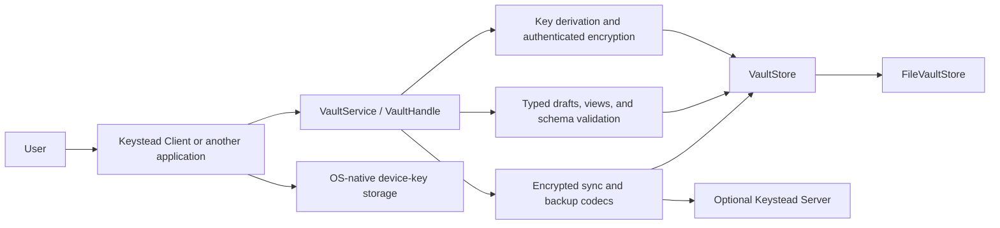

# Keystead Core

[](https://www.apache.org/licenses/LICENSE-2.0)

Keystead Core is the Java 25 security and data-model foundation of Keystead, a
local-first, zero-knowledge secret-vault system. Core owns the behavior that
must remain independent of any UI or synchronization service: key derivation,
authenticated encryption, typed secret schemas, native secret memory, local
persistence, encrypted backup and sync formats, device provisioning, recovery,
and key rotation.

This repository is written for Java integrators, security reviewers, and
contributors. People looking for the desktop password manager should start
with Keystead Client; self-hosters should start with Keystead Server.

## The Keystead ecosystem

Keystead is delivered as three independently versioned repositories:

| Project | For | Responsibility |
| --- | --- | --- |
| **[Keystead Core](https://github.com/MidCoard/keystead)** | Java developers and contributors | Cryptography, secret models, vault persistence, encrypted interchange formats, recovery and rotation primitives, and native memory/process protection |
| **[Keystead Client](https://github.com/MidCoard/keystead-client)** | Desktop users | Local vault UI, generators, reveal and clipboard lifecycle, OS-native device-key storage, sync, sharing, rotation, backup, and recovery workflows |
| **[Keystead Server](https://github.com/MidCoard/keystead-server)** | Self-hosters and operators | Accounts, verified devices, opaque encrypted-row synchronization, wrapped-key distribution, collaboration, rotation/recovery coordination, and audit events |

The product-level security boundary is composed from all three projects. Core
encrypts and owns the protocol; Client is where plaintext is used and where
Windows DPAPI, macOS Keychain, or Linux Secret Service protects device identity
material; Server coordinates ciphertext and public lifecycle state without
receiving a raw vault key or plaintext secret.

## Why Keystead Core exists

A password manager is more than a map of names to encrypted strings. It needs a
stable record model, explicit revision semantics, safe deletion propagation,
recoverable writes, key lifecycle rules, and APIs that avoid turning plaintext
into long-lived application state.

Keystead Core makes those rules part of the library instead of leaving every
client to invent them. Its design goals are:

- keep secret payloads encrypted at rest and outside narrowly scoped callbacks;
- make record and key state transitions explicit and testable;
- keep the synchronization server outside the decryption boundary;
- represent different credential types with canonical schemas;
- fail closed on unsupported algorithms, malformed rows, revision regressions,
  and incomplete device packages;
- preserve compatibility through versioned vault headers, records, and backup
  formats.

## Architecture


```mermaid
flowchart LR
    User["User"] --> Client["Keystead Client or another application"]
    Client --> API["VaultService / VaultHandle"]
    API --> Schema["Typed drafts, views, and schema validation"]
    API --> Crypto["Key derivation and authenticated encryption"]
    API --> Sync["Encrypted sync and backup codecs"]
    Crypto --> Store["VaultStore"]
    Schema --> Store
    Sync --> Store
    Store --> File["FileVaultStore"]
    Client --> OS["OS-native device-key storage"]
    Sync --> Server["Optional Keystead Server"]
```

The boundaries have different responsibilities:

| Boundary | Responsibility |
| --- | --- |
| `VaultService` | Creates, opens, provisions, and rotates vaults. |
| `VaultHandle` | Performs typed secret operations while an unlocked vault key is alive. |
| Drafts and views | Expose plaintext through caller-controlled, short-lived callbacks. |
| `DefaultCryptoService` | Derives and wraps keys, encrypts payloads, and processes device key packages. |
| `VaultStore` | Defines durable vault-header, record, tombstone, and rotation operations. |
| Sync and backup codecs | Move encrypted rows without decrypting their secret payloads. |

`FileVaultStore` is the included filesystem implementation. The `VaultStore`
interface is deliberately separate so applications can supply another durable
store without replacing the cryptographic or record model.

## How a vault operation works

1. A master password derives a wrapping key using the KDF parameters stored in
   the vault header. The derived key unwraps a random vault key; it is not used
   directly as the record-encryption key.
2. `VaultHandle` keeps the unwrapped vault key only for the lifetime of the
   handle. Closing the handle destroys its owned key material.
3. A typed draft validates metadata and required fields against the canonical
   `SecretTypeSchema`.
4. The secret payload is encoded and encrypted with authenticated encryption.
   Vault ID, record metadata, and revision are encoded as authenticated data so
   rows cannot be silently moved or relabeled.
5. The store commits the encrypted record and its monotonic revision. Deletes
   become tombstones so another device can learn that a record was removed.
6. Reads decrypt inside a typed view callback. The caller decides how briefly
   to expose copied character or byte arrays.

The server, if used, receives encrypted profiles, encrypted envelopes, revision
data, tombstones, and wrapped vault-key packages. It does not receive the vault
key or plaintext secret fields.

## Capabilities

### Vault and record lifecycle

- Create and open password-protected vaults.
- Provision a vault from a device-wrapped vault-key package.
- Add, update, list, reveal, and delete typed secrets.
- Rotate the vault key and re-encrypt current records.
- Reject stale revisions and report import conflicts rather than silently
  replacing newer local state.

### Generators

- Configurable passwords and API tokens.
- Ed25519 and RSA SSH key material.
- RSA-first OpenPGP key pairs.
- MFA seeds and `otpauth` URIs.
- RFC 6238 TOTP current codes generated from an MFA seed.
- X.509 certificate/private-key bundles.

Generated private material is owned by `SecretBuffer`-based or
`AutoCloseable` values so callers can deterministically destroy it.

### Data movement

- Deterministic encrypted export ordered by revision and secret ID.
- Tombstone propagation and structured sync conflict reports.
- Versioned encrypted backup archives with manifest and entry integrity checks.
- Safe restore that rejects a conflicting existing vault header before writing.
- Device-specific wrapped vault-key packages for zero-knowledge provisioning.

### Recovery and collaborative key lifecycle

- Offline recovery-kit material whose account credential and recovery private
  key are derived and encrypted on the client side.
- Recovery-bound vault-key packages that let a valid kit rewrap the current
  vault key without disclosing it to a server.
- Canonical verified-device recovery requests that can be signed by an
  existing trusted device.
- Prepared vault-key rotations that generate the next key without changing
  the live vault until all required recipient packages are ready.
- Restart-safe resumption from a device-wrapped staged package, followed by an
  atomic local commit.

## Secret type model

Keystead does not treat every item as an arbitrary collection of strings.
`SecretTypeCatalog` is the source of truth for field names, sensitivity,
required fields, reveal eligibility, import aliases, export names, optional
length limits, taxonomy defaults, and custom-field policy.

The current vocabulary is:

| Type | Typical protected fields |
| --- | --- |
| `LOGIN_PASSWORD` | Username, password, URL, and notes |
| `SECURE_NOTE` | Note body |
| `SSH_KEY` | Private key, public key, passphrase, and comment |
| `API_TOKEN` | Token, endpoint, and account context |
| `GPG_KEY` | Private key, public key, passphrase, and identity |
| `MFA_SECRET` | Seed and `otpauth` URI |
| `CERTIFICATE` | Certificate, private key, and passphrase |
| `GENERIC_SECRET` | Schema-permitted custom secret fields |

Strict types reject unknown or incomplete field shapes. This gives importers,
exporters, desktop forms, and protocol clients one effective vocabulary.

## Cryptography and key lifecycle

The default configuration uses PBKDF2-HMAC-SHA-256 with 120,000 iterations to
wrap a random vault key and AES-256-GCM for secret payloads. The algorithm
registry also recognizes PBKDF2-HMAC-SHA-512 and ChaCha20-Poly1305 for compatible
rows. Device wrapping uses an approved Tink ECIES P-256 package format.

These are format and implementation choices, not a claim that one fixed KDF
cost is ideal for every deployment. Applications should treat algorithm
registry changes and KDF upgrades as migrations, benchmark parameters for their
target hardware, and retain compatibility tests for existing vaults. A new
password KDF requires an explicitly registered `PasswordKeyDerivation`
provider, canonical parameters in the vault header, and migration and
compatibility tests for both existing and new headers. Unknown algorithms and
unsupported parameters fail closed; Core does not fall back to another KDF.

Key material is represented by owned objects such as `VaultKey`,
`DeviceKeyPair`, and `SecretBuffer`. They copy caller data at boundaries,
redact `toString()`, reject use after destruction, and wipe owned arrays when
closed. `SecretBuffer` is a provider-backed facade over `SecretMemoryProvider`.
The convenience default is `SecretMemoryProvider.systemDefault()`, which returns
the fail-closed `NativeLockedSecretMemoryProvider`: secret bytes are copied into
a page-locked native buffer, and a missing native prerequisite
raises `NativeMemoryUnavailableException` rather than silently falling back to
heap memory. Applications that must tolerate the absence of native access can
explicitly downgrade with `SecretMemoryProvider.heap()`, which keeps a wiped
heap array, and every convenience type retains an overload that accepts an
explicit provider. See
[Native memory and process hardening](#native-memory-and-process-hardening)
for the lifecycle, per-platform backends, and deployment responsibilities.

Wiping and page locking reduce the lifetime and exposure of Keystead-owned
copies, but they are not a guarantee of perfect erasure or full live-memory
resistance. Locking prevents locked pages from being paged to disk and dump
exclusion removes them from core dumps on supported platforms; neither defeats
a debugger, an injected agent, a privileged process reader, copying garbage
collection, JIT or native temporaries, or a copy owned by a cryptographic or
memory provider.

Recovery-kit material follows the same ownership model. `RecoveryKitCodec`
encodes a kit with `encodeSecret(RecoveryKit)` and decodes with
`decode(SecretBuffer)`, so the complete encoded kit lives only in mutable,
closeable storage; there is no `String`-returning codec, because an immutable
secret `String` remains visible in JVM heap dumps and cannot be wiped
deterministically. `DeviceKeyPair` exposes its private key only through
`copyPrivateKey(Consumer<byte[]>)`, which hands bytes to a callback without
retaining a copy; there is no accessor that returns the private key as an array.

Core enforces resource ceilings at untrusted file, envelope, package, sync, and
KDF boundaries:

| Input | Maximum |
| --- | ---: |
| Stored properties file | 1,048,576 bytes |
| Encrypted-envelope ciphertext | 1,048,576 bytes |
| Encrypted-envelope authenticated data (AAD) | 65,536 bytes |
| Encoded sync profile | 2,097,152 characters |
| Encoded sync envelope | 2,097,152 characters |
| Wrapped device or recovery vault-key package | 1,048,576 bytes |
| Password-KDF salt | 64 bytes |
| PBKDF2 iterations | 10,000,000 |
| Canonical KDF parameters | 16 entries; printable ASCII names of at most 64 characters; positive integer values no greater than `Integer.MAX_VALUE` |

The 1 MiB envelope limit remains available to non-file formats. The properties
file store additionally rejects any model-valid value whose serialized Base64
properties representation would exceed its 1 MiB stored-file limit, before
replacing an existing file.

## Native memory and process hardening

Keystead Core uses the Java 25 Foreign Function and Memory API to keep secret
material in locked native memory and to expose strict, process-wide hardening.
The public contracts live in `top.focess.keystead.memory` and
`top.focess.keystead.security`; FFM segments, addresses, and raw causes never
leave the internal packages.

`SecretMemoryProvider.systemDefault()` (alias `nativeLocked()`) returns the
fail-closed `NativeLockedSecretMemoryProvider`. `protect(byte[])` copies the
value into a page-locked native buffer owned by a shared
`Arena`; a missing prerequisite raises `NativeMemoryUnavailableException`
instead of falling back to heap memory. `SecretMemoryProvider.heap()` is the
explicit downgrade for deployments without native access, and every convenience
type retains an overload that accepts an explicit provider.

Native protection is bounded and lifecycle-closed. `NativeSecretMemory` runs an
`ALLOCATED -> LOCKED -> DUMP_EXCLUDED -> COPY_STARTED -> LIVE` state machine:
allocation, locking, and (on Linux) dump exclusion are verified before the
buffer is live, a one-pass volatile wipe and unlock run on close, and an
owner-free `Cleaner` releases the page if an owner is abandoned. Quota
exhaustion does not reopen access to a closed buffer.
`NativeMemoryProtection.inspect()` performs a one-page
allocate/lock/dump-exclude/wipe/unlock/release probe without retaining the page
and returns a redacted `NativeMemoryProtectionReport` with one entry per
`NativeProtectionControl` in enum order; capability failure is report data and
never throws.

The backends share a reviewed ABI layer and capture `errno` or the Windows last
error into redacted results:

| Platform | Memory backend | Process hardening |
| --- | --- | --- |
| Windows x86-64 | Kernel32 `VirtualAlloc`/`VirtualLock`/`VirtualUnlock`/`VirtualFree` | OS debugger isolation is `APPLICATION_REQUIRED` |
| Linux x86-64/AArch64 | libc `mmap`/`mlock`/`munmap` with `madvise(MADV_DONTDUMP)` | `prctl(PR_SET_DUMPABLE)` and `setrlimit(RLIMIT_CORE)` |
| macOS x86-64/AArch64 | libc `mmap`/`mlock`/`munlock` | `setrlimit(RLIMIT_CORE)` |

`ProcessHardening.inspect()` returns a redacted `ProcessHardeningReport`
snapshot of the applicable controls without mutating, so it never reports
`HardeningStatus.ENFORCED`. `ProcessHardening.applyStrict()` is serialized,
monotonic, idempotent, and non-transactional: it completes every immutable
prerequisite preflight before mutating, then sets and verifies dumpability and
the core limit on Linux and the core limit on macOS. Deployment
responsibilities Core cannot safely enforce are reported as
`HardeningStatus.APPLICATION_REQUIRED`. The hard `RLIMIT_CORE` limit is lowered
irreversibly for an unprivileged process, so `applyStrict()` is intended to run
in an expendable child JVM rather than a long-lived host process; `inspect()`
is the non-mutating entry point.

Consuming applications must grant native access to the Core module:
`--enable-native-access=top.focess.keystead.core` on the module path, or
`--enable-native-access=ALL-UNNAMED` on the classpath. Under
`--illegal-native-access=deny` or without the grant, the native provider fails
closed. On Linux, `mlock` is bounded by `RLIMIT_MEMLOCK` and `CAP_IPC_LOCK`;
deployments that want locked secret memory should raise the memlock limit or
grant the capability. Locked memory and dump exclusion are bounded in-memory
guarantees: they reduce paging and core-dump exposure, not resistance to a
live-memory attacker with process control.

## Synchronization model

Synchronization operates on encrypted rows, not decrypted secrets.

- Revisions are positive and monotonic within a vault.
- Exports are stable by revision and secret ID.
- A delete produces a tombstone with no encrypted payload fields.
- Importing a newer tombstone removes the local active record.
- An older remote row cannot overwrite newer local state; conflicts are
  returned in `SyncImportReport`.
- Mixed-vault imports are rejected before any row is written.
- Server pagination advances through explicit revision cursors.

Automatic tombstone compaction is intentionally not implemented. The server
can record device pull acknowledgements and evaluate conservative eligibility,
but deleting tombstones automatically would require stronger retention and
device-acknowledgement guarantees.

## Backup and crash recovery

`BackupArchiveCodec` writes encrypted, versioned archives. Entry digests detect
corruption; they do not add secrecy beyond the encrypted payload. The reader
returns structured unsupported/corrupt-entry information where possible, and
restore reports skipped or conflicting rows.

`FileVaultStore` uses atomic replacement for durable files. Vault-key rotation
uses a journal because it changes the header, active records, and tombstones as
one logical operation. Startup recovery examines the journal and completes or
rolls back the interrupted transition. Crash-injection tests cover failures at
the journal and replacement boundaries.

## Security model and threat boundaries

Keystead Core is designed to protect a vault when encrypted files or the sync
database are copied by an attacker who does not possess the master password,
device private key, or unlocked vault key.

It does not protect against:

- malware or a debugger controlling the process while the vault is unlocked;
- a compromised client that captures plaintext before encryption;
- weak master passwords or poorly chosen deployment-specific KDF parameters;
- loss of every password, device key, and backup;
- malicious changes to the library binary or its dependencies;
- sensitive local listing metadata being observed by an attacker with access
  to the local vault directory. Secret payload fields are encrypted, but local
  record metadata exists to support listing and synchronization.

The optional server is zero-knowledge with respect to secret contents, but it
still observes operational information such as account identity, device IDs,
vault IDs, revisions, membership, timestamps, and ciphertext sizes. Zero
knowledge does not mean zero metadata.

## Public API example

```java
Path directory = Path.of("vault-data");
VaultId vaultId = new VaultId(UUID.randomUUID());
Console console = Objects.requireNonNull(System.console(), "A secure console is required");
char[] masterPassword = console.readPassword("Vault password: ");
char[] loginPassword = console.readPassword("Login password: ");

VaultService vaults = new DefaultVaultService(new FileVaultStore(directory));

try (VaultHandle vault =
        vaults.createVault(new CreateVaultRequest(vaultId), masterPassword);
     SecretBuffer username = SecretBuffer.fromChars("alice@example.com".toCharArray());
     SecretBuffer password = SecretBuffer.fromChars(loginPassword)) {

    SecretId id = vault.saveLogin(draft -> draft
            .title("Example account")
            .username(username)
            .password(password)
            .url("https://example.com"));

    vault.withLogin(id, view ->
            view.withPassword(chars -> usePasswordBriefly(chars)));
} finally {
    Wipe.wipe(masterPassword);
    Wipe.wipe(loginPassword);
}
```

The application owns the input password arrays and must wipe them. `Wipe`
(`top.focess.keystead.memory.Wipe`, the same utility the library uses
internally) zeroes a `byte[]` or `char[]` in place and is null-safe. Secret
views provide copied data only inside callbacks; callers should avoid
converting it to immutable `String` values.

## Repository structure

```text
keystead-core/src/main/java/top/focess/keystead/
|-- aigc/        AI-generated-content organization context
|-- crypto/      key ownership, algorithms, wrapping, and AEAD
|-- generator/   password, token, SSH, GPG, MFA, TOTP, and certificate generation
|-- memory/      wipeable and native-locked secret buffers
|-- model/       vault IDs, schemas, encrypted rows, and metadata
|-- recovery/    recovery kits, device requests, and vault-key packages
|-- security/    process-hardening inspection and strict application
|-- service/     public vault, backup, and sync workflows
`-- store/       persistence abstraction and filesystem implementation
```

The module descriptor `module-info.java` declares the named module
`top.focess.keystead.core` and exports the public packages above; the
`memory.internal` and `security.internal` packages hold the FFM backends and
are not exported. Production Java APIs use explicit JSpecify annotations. Tests
cover value invariants, crypto behavior, persistence recovery, synchronization,
backups, device provisioning, schema consistency, nullness semantics, and
native-memory/process-hardening lifecycle and subprocess behavior.

## Build and verification

Requires JDK 25. The Gradle toolchain requests Temurin/Adoptium 25 and
auto-provisions it through the Foojay resolver, so an explicit local install is
optional.

```bash
./gradlew :keystead-core:test --no-daemon --rerun-tasks
./gradlew :keystead-core:classpathTest --no-daemon --rerun-tasks
./gradlew :keystead-core:spotlessCheck
```

Core is a named module (`top.focess.keystead.core`). The `test` task runs on the
module path with `--enable-native-access=top.focess.keystead.core` (plus
`--patch-module`, `--add-reads`, and per-package `--add-opens` so tests can
exercise internals). The separate `classpathTest` source set is a consumer
compatibility fixture that runs on the classpath with
`--enable-native-access=ALL-UNNAMED`. On Windows, use `gradlew.bat`.

CI runs Temurin 25 across four 64-bit tuples: Windows x86-64, Linux x86-64,
Linux AArch64, and macOS AArch64. The library also supports macOS x86-64, but
the GitHub-hosted Intel macOS runner is unavailable, so that leg is omitted.
Spotless runs as an independent, non-skipping check.

## Security guarantees and responsibilities

Keystead security is a property of the complete system, not of one repository
in isolation. Core supplies the cryptographic and lifecycle invariants, Client
controls plaintext and integrates desktop security facilities, and Server
coordinates opaque encrypted state.

### What Core enforces

- A master password derives a wrapping key; record encryption uses a separate
  random vault key.
- Algorithms and their canonical parameters are explicit, versioned, and
  checked through fail-closed registries.
- Record identity, metadata, revision, and vault context are authenticated with
  the ciphertext.
- Secret-bearing Core values have explicit ownership, redacted diagnostics,
  use-after-close checks, and deterministic wipe-on-close behavior.
- Native locked memory is the system default. Failure to allocate, lock, or
  establish the required native protection raises an exception instead of
  silently downgrading to ordinary heap storage.
- Sync revisions, tombstones, backup formats, device packages, recovery
  packages, and rotation state have bounded, validated representations.
- `FileVaultStore` uses atomic replacements and a recovery journal so an
  interrupted multi-file key rotation can be completed or rolled back.

### OS-native protection across Keystead

Keystead already uses operating-system security facilities at two different
boundaries:

| Layer | Implemented protection |
| --- | --- |
| Core | Java 25 FFM backends for locked native memory; Linux dump exclusion; Linux/macOS core-dump controls; inspection and redacted reports |
| Client | Windows DPAPI, macOS Keychain, and Linux Secret Service for the device wrapping and proof private keys |

This split is intentional. Memory protection belongs next to the secret-memory
abstraction in Core. Credential-store integration belongs in Client because it
depends on application identity, UI-visible fallback choices, migration, and
the signed-in desktop user.

`ProcessHardening.applyStrict()` is also intentionally explicit. It changes
the entire host JVM, can irreversibly lower the hard core-file limit for an
unprivileged process, and therefore must be called by an application or an
expendable child JVM at the correct lifecycle point. Core provides the
implementation and reports application-required controls; it does not mutate a
host process merely because the library was loaded.

### Integrator and deployment responsibilities

Applications using Core must:

- grant Java native access to the named module or unnamed classpath module;
- decide whether failure-closed native memory is mandatory or whether an
  explicit `SecretMemoryProvider.heap()` downgrade is acceptable;
- run `ProcessHardening.inspect()` during deployment validation and invoke
  strict hardening only in a process whose lifecycle permits it;
- configure Linux memlock limits or capabilities when locked pages are
  required;
- keep plaintext inside short-lived mutable buffers and callbacks, avoid
  immutable `String` copies where practical, and wipe caller-owned arrays;
- choose how device identity material is protected. Keystead Client provides
  the product's DPAPI, Keychain, Secret Service, passphrase-file, and
  memory-only implementations.

### What these controls do not promise

Locked pages, dump exclusion, wiping, and process dump controls reduce
accidental persistence and post-crash disclosure. They cannot prevent a
debugger, injected agent, same-process code, privileged process reader, or
malware that already controls the live application from observing plaintext
while the vault is unlocked.

OS-user-protected credential storage means protection by the signed-in user's
platform facility. It is not biometric-gated release through Windows Hello,
Touch ID, or another platform authenticator. Another process running with the
same user authority may be inside that facility's trust boundary.

Zero knowledge applies to secret contents, not all metadata. A Keystead Server
operator can observe accounts, devices, vault IDs, membership, timestamps,
revisions, activity, and ciphertext sizes. Likewise, local record metadata
used for listing and synchronization is not presented as secret payload
encryption.

Recovery and collaboration preserve the same boundary. Offline recovery kits
and verified-device approval keep vault-key operations on clients, but the
server cannot reconstruct a vault after every kit, eligible device, usable
header, and backup has been lost. Removing a collaborator and rotating the key
protects future key generations; it cannot erase information the former member
already decrypted or copied.

Keystead currently provides a JVM desktop application and self-hosted server.
Core can support additional clients, but browser integration, mobile
applications, passkey/WebAuthn login, and biometric-gated vault unlock are not
implemented in the current product surface.

## Contributing

Contributions should preserve the zero-knowledge boundary, explicit JSpecify
nullness, finite schema vocabulary, backward-readable encrypted formats, and
fail-closed persistence behavior. Add tests at the lowest meaningful boundary,
then run the complete core suite and formatting checks before submitting a
change.

Changes that alter algorithms, authenticated data, vault headers, revisions,
backup formats, or device packages require migration and compatibility tests;
they are protocol changes, not local refactors.

## License

Keystead Core is licensed under the [Apache License, Version 2.0](LICENSE).
Copyright 2026 MidCoard.

Unless you state otherwise, any contribution intentionally submitted for
inclusion in Keystead Core by you, as defined in the Apache-2.0 license, shall
be licensed under the same terms, without any additional conditions or
clauses.
